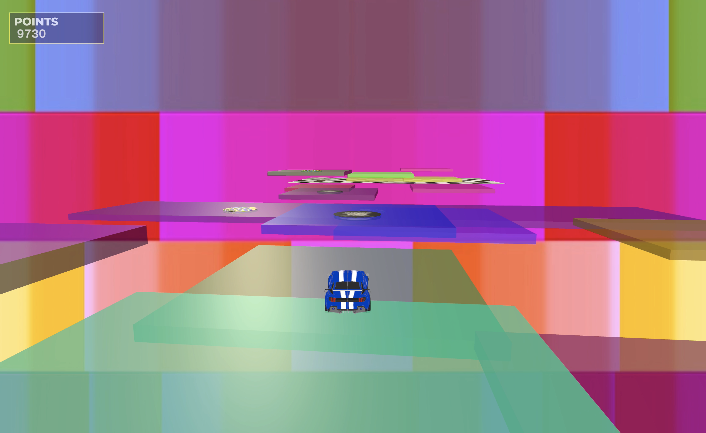

# Platform Races

Platform is a single and multiplayer game made with Unity as an exercise for the course Digital Games of Faculty of Engineering University of Porto.

## Installation

Clone Repo

```bash
git clone https://github.com/bernabranco/react-threejs-afterimage.git
```

## Usage

Open with Unity Hub

## Features
- Single and Multiplayer Mode
- Generative Platforms (movement and color)
- Shader Background


## Images



## Demo

Available at: https://www.youtube.com/watch?v=8lR672EWjyU